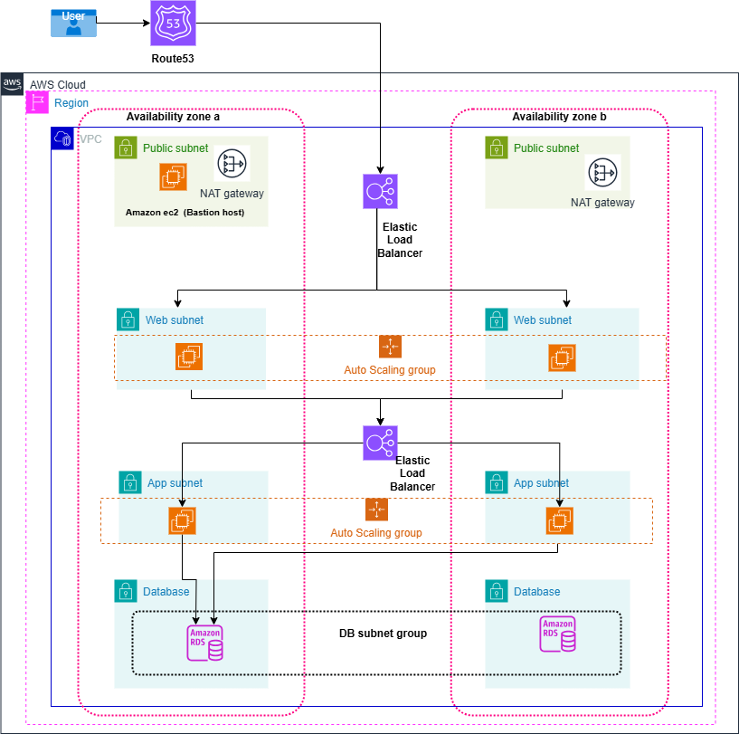

# 3tier_architecture_terraform

This architecture represents a highly available, scalable, and secure AWS infrastructure for a web application. Below is a breakdown of the key components:

# 1. User Access Layer
User: End-users access the application through the internet.
Route 53: AWS's DNS service for domain name resolution.

# 2. Networking Layer (VPC & Subnets)
The infrastructure is deployed inside a VPC (Virtual Private Cloud).
Two Availability Zones (AZs) are used for high availability.
Subnets:
Public Subnets (Green): Contain NAT Gateways and a Bastion Host (EC2 instance) for secure SSH access.
Web Subnets (Light Blue): Hosts web servers (likely EC2 instances in an Auto Scaling Group) behind an Elastic Load Balancer.
App Subnets (Light Orange): Application layer, possibly hosting microservices or backend logic, also in an Auto Scaling Group.
Database Subnets (Purple): Private subnets containing Amazon RDS (Relational Database Service) instances, forming a DB Subnet Group for redundancy.

# 3. Load Balancing & Auto Scaling
Elastic Load Balancer (ELB) distributes incoming traffic to web servers across AZs.
Auto Scaling Groups ensure that instances scale up or down based on demand.

# 4. Security Considerations
Public access is restricted: Only the Bastion Host can be accessed via SSH.
NAT Gateway allows instances in private subnets to access the internet securely (for updates, API calls, etc.).
RDS is in private subnets, preventing direct internet access.
Multi-AZ deployments ensure fault tolerance.

# 5. Database Layer
Amazon RDS provides a managed relational database (e.g., MySQL, PostgreSQL, or Aurora).
Deployed across DB Subnet Groups to ensure high availability.

# 6. Scalability & High Availability
Load Balancers distribute traffic evenly.
Auto Scaling Groups dynamically adjust capacity.
Multi-AZ architecture ensures failover and redundancy.

# Summary
This architecture is well-designed for scalability, fault tolerance, and security, making it suitable for production-grade applications. Let me know if you need a Terraform implementation for this! 

# Workflow Overview

# 1. User Request: A user sends a request, which is routed through Route 53.
# 2. Load Balancing: The ELB distributes the request to an available web server in the web subnet.
# 3. Web Server Processing: The web server processes the request or forwards it to the app server.
# 4. App Server Logic: The app server performs business logic, querying the Amazon RDS database if needed.
# 5. Response Delivery: The data flows back from the app server to the web server, through route53, and then to the user.
